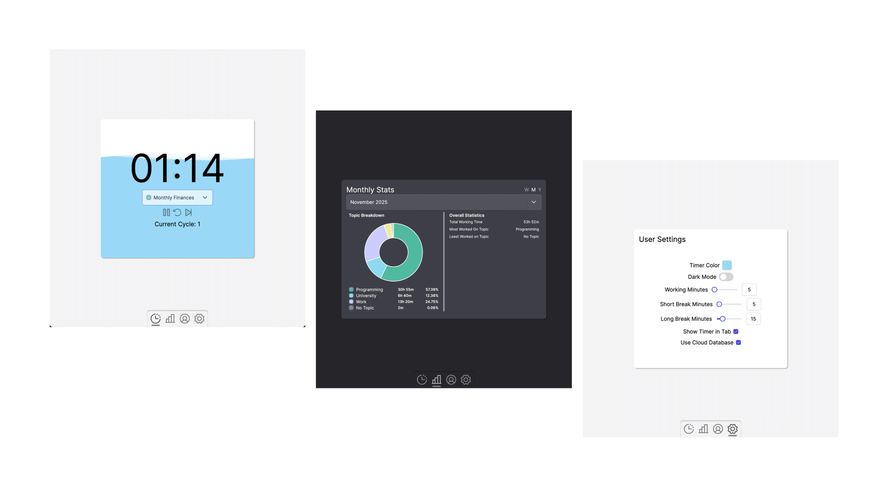

# ⏱️ Zeitful

**An intelligent, privacy-first Pomodoro timer.**

Zeitful builds upon the classic pomodoro timer study technique with time tracking capabilities for tasks and topics you're working on. With Zeitful, users can view work statistics, personalize timer lengths and color, and remain confident that your data is truly yours. Zeitful gives you clear insights into your productivity.

<div style="display: flex; flex-direction: row; align-items: center; gap: 10px;">
  

</div>

---

## 🌟 Features

### 🧠 Intelligent Pomodoro Timer

-   Classic Pomodoro workflow ((Work Session -> Short Break) x3 + Work Session -> Long Break)
-   Session tracking for selected tasks and topics
-   Work and Break notifications

### 📊 Insightful Statistics

-   Meaningful visualizations of your productivity for tasks and topics over weekly, monthly, and annual periods

#### 📌 Topics, Tasks, and Work Entry Structure

-   Topics represent the subject of your work (i.e. Programming) while tasks represent the specifc item you are working on (i.e. Calculator app). When completing a work session, a work entry is stored in your browser.
-   Topic structure:
    | id | name | color | last_action |
-   Task structure:
    | id | topic_id | name | status | last_action|
-   Work Entries structure:
    | id | task_id | topic_id | task_name | topic_name | duration | completion_time |

### 🎛️ Personalization

-   Themes and animation color
-   Customizable session lengths, break intervals, and tab information

### 🛡️ Privacy-First by Design

-   **All data is stored locally by default**
-   Nothing is sent to a company cloud. Your work history remains private
-   Fully functional offline

### 🛠️ Optional Supabase Integration

Prefer cloud syncing or cross-device access? Zeitful supports:

-   Connecting your own **Supabase** instance
-   Secure syncing of sessions, preferences, and stats
-   Data importing and exporting

---

## 🔧 Database Configuration

### Local Storage (Default)

No setup needed. Zeitful will securely store your session data on your device.

### Supabase Setup (Optional)

If you want cloud sync:

1. Create a Supabase project
2. Generate your project URL and anon/public key
3. Create a local json file (or use [this template](.github/templates/zeitful_supabase_credentials_template.json)) with the following structure and add replace the database_url and api_key with the generated supabase project_url and anon_key:

```json
{
	"database_url": "https://YOUR_PROJECT_ID.supabase.co",
	"api_key": "YOUR_ANON_KEY"
}
```

4. Ensure required tables (e.g. `work_tasks`, `work_topics`, `work_topics`) exist. Run the following in the sql editor:

```
CREATE TABLE IF NOT EXISTS work_topics (
      id TEXT PRIMARY KEY,
      name TEXT NOT NULL,
      color TEXT NOT NULL,
      last_action TEXT
    );

    CREATE TABLE IF NOT EXISTS work_tasks (
      id TEXT PRIMARY KEY,
      topic_id TEXT,
      name TEXT,
      status TEXT NOT NULL CHECK(status IN ('Open', 'Active', 'Closed')),
      last_action TEXT
    );

    CREATE TABLE IF NOT EXISTS work_entries (
      id TEXT PRIMARY KEY,
      task_id TEXT,
      topic_id TEXT,
      task_name TEXT,
      topic_name TEXT,
      duration REAL NOT NULL,
      completion_time TEXT NOT NULL
    );
```

---

## 🤝 Contributing

If there's any feedback or improvement I can make, please open an issue.
Pull requests are welcome!

---

## 📄 License

[Apache-2.0 License](LICENSE)
