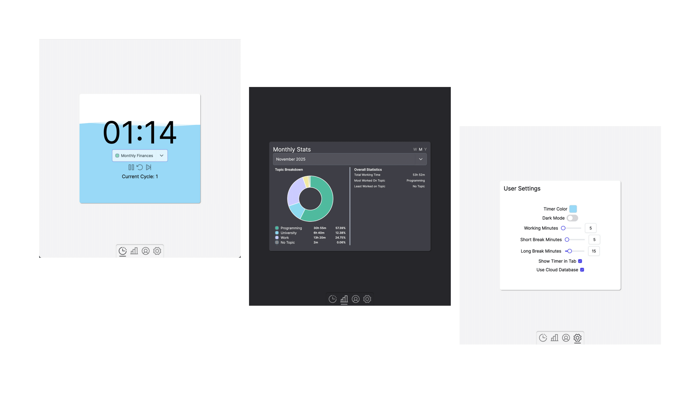

# ⏱️ Zeitful

[![React][React.js]][React-url] [![TypeScript][TypeScript]][TypeScript-url] [![SQL][SQL]][SQL-url] [![Tailwind CSS][TailwindCSS]][TailwindCSS-url]

**An intelligent, privacy-first Pomodoro timer.**

Zeitful builds upon the classic pomodoro timer study technique with time tracking capabilities for tasks and topics you're working on. With Zeitful, users can view work statistics, personalize timer lengths and color, and remain confident that your data is truly yours. Zeitful gives you clear insights into your productivity.

<div style="display: flex; flex-direction: row; align-items: center; gap: 10px;">
  

</div>

---

## 🌟 Features

### 🧠 Intelligent Pomodoro Timer

-   Classic Pomodoro workflow ((Work Session -> Short Break) x3 + Work Session -> Long Break)
-   Session tracking for selected tasks and topics
-   Work and Break notifications

### 📊 Insightful Statistics

-   Meaningful visualizations of your productivity for tasks and topics over weekly, monthly, and annual periods

#### 📌 Topics, Tasks, and Work Entry Structure

-   Topics represent the subject of your work (i.e. Programming) while tasks represent the specifc item you are working on (i.e. Calculator app). When completing a work session, a work entry is stored in your browser.
-   Topic structure:
    | id | name | color | last_action | last_action_date
-   Task structure:
    | id | topic_id | name | status | last_action | last_action_date
-   Work Entries structure:
    | id | task_id | topic_id | task_name | topic_name | duration | completion_time |

### 🎛️ Personalization

-   Themes and animation color
-   Customizable session lengths, break intervals, and tab information

### 🛡️ Privacy-First by Design

-   **All data is stored locally by default**
-   Nothing is sent to a company cloud. Your work history remains private
-   Fully functional offline

### 🛠️ Optional Supabase Integration

Prefer cloud syncing or cross-device access? Zeitful supports:

-   Connecting your own **Supabase** instance
-   Secure syncing of sessions, preferences, and stats
-   Data importing and exporting

---

## 🔧 Database Configuration

### Local Storage (Default)

No setup needed. Zeitful will securely store your session data on your device.

### Supabase Setup (Optional)

If you want cloud sync:

1. Create a Supabase project
2. Generate your project URL and anon/public key
3. Create a local json file (or use [this template](.github/templates/zeitful_supabase_credentials_template.json)) with the following structure and add replace the database_url and api_key with the generated supabase project_url and anon_key:

```json
{
	"database_url": "https://YOUR_PROJECT_ID.supabase.co",
	"api_key": "YOUR_ANON_KEY"
}
```

4. Ensure required tables (e.g. `work_tasks`, `work_topics`, `work_topics`) exist. Run the following in the sql editor:

```
     CREATE TABLE IF NOT EXISTS work_topics (
		id BLOB(16) PRIMARY KEY, -- UUID as 16-byte BLOB
		name TEXT NOT NULL,
		color INTEGER NOT NULL, -- 0xRRGGBB stored as INTEGER
		last_action INTEGER, -- 1=Added, 2=Edited, 3=Deleted
		last_action_date TEXT
	);

	CREATE TABLE IF NOT EXISTS work_tasks (
		id BLOB(16) PRIMARY KEY, -- UUID
		topic_id BLOB(16),
		name TEXT NOT NULL,
		status INTEGER NOT NULL CHECK(status IN (1,2,3)), -- 1=Open, 2=Active, 3=Closed
		last_action INTEGER, -- same enum as above
		last_action_date TEXT
	);

	CREATE TABLE IF NOT EXISTS work_entries (
		id BLOB(16) PRIMARY KEY, -- UUID
		task_id BLOB(16),
		topic_id BLOB(16),
		task_name TEXT,
		topic_name TEXT,
		duration REAL NOT NULL, -- minutes
		completion_time TEXT NOT NULL
	);
```

---

## 🤝 Contributing

If there's any feedback or improvement I can make, please open an issue.
Pull requests are welcome!

---

## 📄 License

[Apache-2.0 License](LICENSE)

<!-- MARKDOWN LINKS & IMAGES -->
<!-- https://www.markdownguide.org/basic-syntax/#reference-style-links -->
[React.js]: https://img.shields.io/badge/React-20232A?style=for-the-badge&logo=react&logoColor=61DAFB
[React-url]: https://reactjs.org/
[TypeScript]: https://img.shields.io/badge/TypeScript-007ACC?style=for-the-badge&logo=typescript&logoColor=white
[TypeScript-url]: https://www.typescriptlang.org/
[SQL]: https://img.shields.io/badge/SQL-4479A1?style=for-the-badge&logo=mysql&logoColor=white
[SQL-url]: https://www.mysql.com/
[TailwindCSS]: https://img.shields.io/badge/Tailwind_CSS-38B2AC?style=for-the-badge&logo=tailwind-css&logoColor=white
[TailwindCSS-url]: https://tailwindcss.com/
